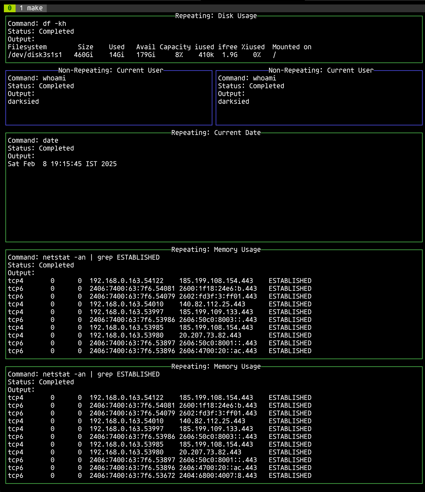

# swissknife

## usage

write a `commands.yaml`

```yaml
commands:
  - name: "Disk Usage"
    command: "df -kh"
    repeat: 5
  - name: "Current Date"
    command: "date"
    repeat: 1 
  - name: "Current User"
    command: "whoami"
    repeat: 0
  - name: "Current User"
    command: "whoami"
    repeat: 0
  - name: "Memory Usage"
    command: "netstat -an | grep ESTABLISHED"
    repeat: 2
```

run with:

```shell
$> ./swissknife -cfg=./commands.2.yaml,./commands.1.yaml
```

browsing:

- Use keys `n`, `p`, to traverse pages when using multiple yaml files
- Use `q` to quit

## ui


